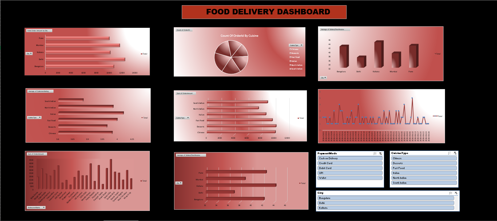

# Food Delivery Business Intelligence & Interactive Analytics Dashboard

[](https://powerbi.microsoft.com/)
[](https://www.microsoft.com/en-us/microsoft-365/excel)
[](https://learn.microsoft.com/en-us/dax/)
[](https://www.webskitters.com/)
[](LICENSE)

An end-to-end **Food Delivery Data Analysis and Interactive Business Intelligence Dashboard** project developed during the Summer Internship at **Webskitters Technology Solutions Pvt. Ltd.** in collaboration with the Department of Computer Science & Engineering (AIML), **Dr. B. C. Roy Engineering College, Durgapur**.

This project provides comprehensive insights into revenue performance, city-wise sales, customer satisfaction ratings, delivery logistics, cuisine preferences, and payment channel distribution using both **Microsoft Power BI** and **Microsoft Excel**.

---

## 📌 Table of Contents

- [Project Overview](#-project-overview)
- [Key Features & Highlights](#-key-features--highlights)
- [Dashboard Previews](#-dashboard-previews)
  - [Power BI Dashboard (Dark Theme)](#1-power-bi-dashboard-dark-theme)
  - [Power BI Dashboard (Light Theme)](#2-power-bi-dashboard-light-theme)
  - [Excel Interactive Dashboard](#3-excel-interactive-dashboard)
- [Key Business Insights & Metrics](#-key-business-insights--metrics)
- [Dataset Architecture](#-dataset-architecture)
- [Technology Stack & Tools](#-technology-stack--tools)
- [Repository Structure](#-repository-structure)
- [How to Run & Explore](#-how-to-run--explore)
- [Authors & Acknowledgments](#-authors--acknowledgments)

---

## 🚀 Project Overview

The objective of this project is to analyze raw operational and transactional records from an online food delivery ecosystem and convert them into actionable business intelligence visualizations. 

By tracking key business indicators such as gross revenue, order volume, average delivery duration, and customer feedback across metro cities, stakeholders can optimize restaurant partnerships, streamline logistics, and launch targeted promotional campaigns.

### Key Objectives:
- **Revenue Tracking**: Monitor total revenue (~₹55K) and track performance across cities and cuisines.
- **Customer Feedback Correlation**: Identify rating distributions across cuisines and compare customer satisfaction against order volumes.
- **Logistics & Delivery Efficiency**: Analyze delivery duration across different cities to detect operational bottlenecks.
- **Dynamic Exploration**: Enable intuitive drill-downs using multi-criteria slicers (Month, City, Cuisine, Payment Mode) and dynamic theme toggles (Light/Dark mode via Power BI Bookmarks).

---

## ✨ Key Features & Highlights

- **Dual Platform Implementation**: Full analytical models implemented in both **Microsoft Power BI** (`.pbix`) and **Microsoft Excel** (`.xlsx`).
- **Interactive Filtering & Slicing**: Dynamic multi-parameter slicers for City, Cuisine Type, Month, and Payment Method.
- **Theme Switcher**: Bookmark and selection-pane-driven toggle between **Dark Mode** and **Light Mode** in Power BI.
- **Advanced DAX & Formulas**: Custom DAX measures for KPIs, rating variances, order aggregations, and delivery time metrics.
- **Comprehensive Documentation**: Complete analytical project reports in `.docx` format detailing data quality, problem-solving methodologies, and strategic recommendations.

---

## 📊 Dashboard Previews

### 1. Power BI Dashboard (Dark Theme)
*High-contrast modern dark mode with KPI cards, horizontal bar charts, line-area combinations, and donut revenue distributions.*


### 2. Power BI Dashboard (Light Theme)
*Clean enterprise light mode designed for executive presentations and reporting.*


### 3. Excel Interactive Dashboard
*Dynamic Excel dashboard powered by Pivot Tables, Pivot Charts, Conditional Formatting, and interactive Slicers.*




---

## 📈 Key Business Insights & Metrics

| Metric / Analysis Dimension | Summary & Findings |
| :--- | :--- |
| **Total Revenue** | **~₹55,000+** across 130 transaction records spanning March to June. |
| **Top Performing Cities** | Delhi and Mumbai lead total sales volume and revenue generation, followed closely by Bengaluru, Kolkata, and Pune. |
| **Cuisine Breakdown** | **Chinese**, **North Indian**, and **Fast Food** dominate customer order preferences and generate the largest share of revenue. |
| **Delivery Time Performance** | Average delivery times range from 25–45 minutes across metro zones; operational efficiency directly correlates with higher customer ratings. |
| **Payment Preferences** | Balanced distribution across **Credit Card**, **Debit Card**, and **Cash on Delivery (COD)** payment modes. |

---

## 📁 Dataset Architecture

The underlying dataset (`Group5_FoodDelivery_Excel_dashboard.xlsx`) consists of 130 structured transaction records with zero missing or duplicate values:

| Field Name | Data Type | Description |
| :--- | :--- | :--- |
| `OrderID` | Text / Integer | Unique identifier for each customer transaction |
| `OrderDate` | Date | Date when the order was placed (March – June) |
| `City` | Text | Delivery destination city (Delhi, Mumbai, Bengaluru, Kolkata, Pune) |
| `RestaurantName` | Text | Partner restaurant fulfilling the order |
| `CuisineType` | Text | Cuisine category (Chinese, Fast Food, Italian, Desserts, South Indian, North Indian) |
| `OrderAmount` | Currency / Numeric | Total billing value of the food order |
| `DeliveryTimeMinutes` | Integer | Total delivery duration in minutes from dispatch to doorstep |
| `PaymentMode` | Text | Payment channel used (Credit Card, Debit Card, COD) |
| `CustomerRating` | Decimal (1.0 - 5.0) | Rating score submitted by the customer |

---

## 🛠 Technology Stack & Tools

- **Business Intelligence**: Microsoft Power BI Desktop
- **Data Modeling & Analytics**: DAX (Data Analysis Expressions), Power Query M
- **Spreadsheet Analytics**: Microsoft Excel (Pivot Tables, Slicers, Conditional Formatting, Dynamic Charts)
- **Documentation**: Microsoft Word (`.docx`)

---

## 📂 Repository Structure

```text
├── assets/
│   ├── powerbi_dashboard_dark.png       # Power BI Dark Theme Dashboard Preview
│   ├── powerbi_dashboard_light.png      # Power BI Light Theme Dashboard Preview
│   ├── excel_dashboard_overview.png     # Excel Interactive Dashboard Overview
│   └── excel_dashboard_analytics.png    # Excel Analytics & Pivot Breakdown
├── Food_Delivery_PowerBI_Dashboard.pbix # Interactive Power BI Dashboard file
├── Group5_FoodDelivery_Excel_dashboard.xlsx # Raw data + Interactive Excel Dashboard
├── Food_Delivery_Report_Analysis_PowerBI_SARNENDU DAS.docx # Power BI Detailed Internship Report
├── Food_Delivery_Ananlysis_Report_Excel_SARNENDU DAS.docx  # Excel Detailed Internship Report
├── .gitignore                           # Git ignore rules for office temp files
└── README.md                            # Project documentation & summary
```

---

## 💻 How to Run & Explore

### 1. Opening the Power BI Dashboard
1. Ensure you have [Microsoft Power BI Desktop](https://powerbi.microsoft.com/desktop/) installed.
2. Clone or download this repository.
3. Open `Food_Delivery_PowerBI_Dashboard.pbix`.
4. Interact with the slicers on the left/top or toggle between Light and Dark themes via the bookmark buttons.

### 2. Opening the Excel Dashboard
1. Open `Group5_FoodDelivery_Excel_dashboard.xlsx` in **Microsoft Excel (2016 or later)** or Office 365.
2. Navigate to the **Dashboard** sheet.
3. Click on the Slicers (City, Cuisine, Month) to filter the pivot visualizations dynamically.

---

## 👥 Authors & Acknowledgments

**Author & Project Lead**: **Sarnendu Das**  
*Department of Computer Science & Engineering (AIML)*  
*Dr. B. C. Roy Engineering College, Durgapur*  

### Group Contributors:
- Sarnendu Das
- Sandip Paul
- Sudipta Sen
- Rupshaa Pal
- Akash Mitra
- Sanjana Paramanik
- Nishan Konar
- Sayan Goswami

### Mentorship & Guidance:
- **Amit Chatterjee** (Webskitters Technology Solutions Pvt. Ltd.)
- **Soumyajit Biswas** (Webskitters Technology Solutions Pvt. Ltd.)

*Special thanks to **Webskitters Technology Solutions Pvt. Ltd.** and the **Department of CSE (AIML), Dr. B. C. Roy Engineering College** for their continuous support and resources.*
