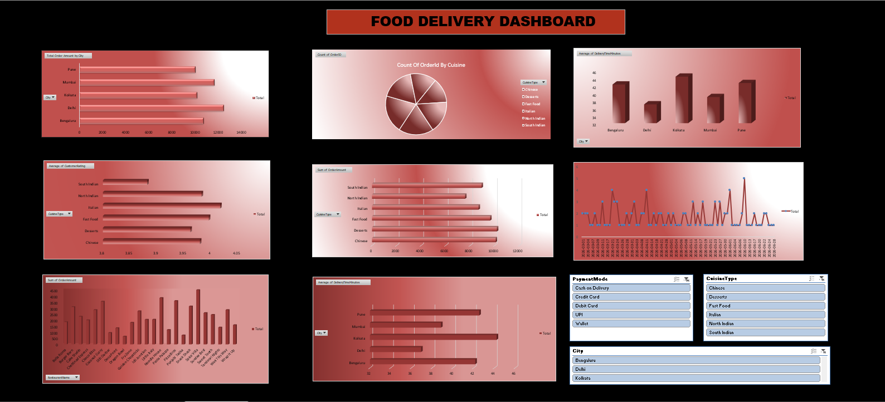

# Summer Internship Project Report: Interactive Food Delivery Analysis Dashboard Using Microsoft Excel

**Organization**: Webskitters Technology Solutions Pvt. Ltd.  
**Author**: Sarnendu Das  
**Department**: Computer Science & Engineering (Artificial Intelligence and Machine Learning)  
**Institution**: Dr. B. C. Roy Engineering College, Durgapur  
**Under the Guidance of**: Amit Chatterjee & Soumyajit Biswas  

---

## 📑 Acknowledgement

I would like to express my heartfelt gratitude to all those who contributed to the successful completion of this project titled *"Interactive Food Delivery Analysis Dashboard using Microsoft Excel."* This project has provided valuable practical exposure to data analysis, dashboard development, and business intelligence using Microsoft Excel.

I sincerely thank my faculty mentors, **Amit Chatterjee** and **Soumyajit Biswas**, for providing continuous guidance, motivation, and constructive suggestions throughout every stage of the project. I am also grateful to the **Department of Computer Science and Engineering (AIML), Dr. B. C. Roy Engineering College, Durgapur** for providing learning resources and an encouraging academic environment.

---

## 📌 Table of Contents
1. [Project Title & Overview](#1-project-title--overview)
2. [Project Objectives](#2-project-objectives)
3. [Dataset Structure & Cleaning Process](#3-dataset-structure--cleaning-process)
4. [Development Methodology & Workflow](#4-development-methodology--workflow)
5. [Excel Dashboard Visualizations](#5-excel-dashboard-visualizations)
6. [Challenges Encountered & Solutions](#6-challenges-encountered--solutions)
7. [Business Insights & Performance Findings](#7-business-insights--performance-findings)
8. [Future Scope](#8-future-scope)
9. [Learning Outcomes](#9-learning-outcomes)
10. [Conclusion](#10-conclusion)

---

## 1. Project Title & Overview

**Title**: *Interactive Food Delivery Analysis Dashboard using Microsoft Excel*

This project leverages the analytical and visualization capabilities of **Microsoft Excel** to create a dynamic, multi-dimensional business intelligence dashboard for online food delivery transactions. The system cleans, structures, and visualizes 130 delivery records across cities, restaurants, cuisines, and payment channels.

---

## 2. Project Objectives

- Perform systematic data cleaning, formatting, and structural validation in Microsoft Excel.
- Build multi-dimensional **Pivot Tables** to summarize key operational and sales dimensions.
- Design dynamic **Pivot Charts** with consistent color palettes, data labels, and descriptive titles.
- Implement **Interactive Slicers** with multi-table *Report Connections* for unified drill-down filtering.
- Derive actionable business insights to assist restaurant partners and operational managers.

---

## 3. Dataset Structure & Cleaning Process

The dataset consists of 130 food delivery records stored in `Group5_FoodDelivery_Excel_dashboard.xlsx`:

| Column Name | Data Type | Purpose / Description |
| :--- | :--- | :--- |
| `OrderID` | Text | Unique identifier for each order |
| `OrderDate` | Date | Order transaction date (formatted as `YYYY-MM-DD`) |
| `City` | Text | Destination city (Delhi, Mumbai, Bengaluru, Kolkata, Pune) |
| `RestaurantName` | Text | Restaurant partner name |
| `CuisineType` | Text | Cuisine category (Chinese, Fast Food, Italian, Desserts, South/North Indian) |
| `OrderAmount` | Currency | Total transaction amount in INR |
| `DeliveryTimeMinutes` | Numeric | Delivery time from order confirmation to doorstep |
| `PaymentMode` | Text | Payment channel (Credit Card, Debit Card, Cash on Delivery) |
| `CustomerRating` | Numeric (1.0 - 5.0) | Customer satisfaction score |

### Data Cleaning Checklist:
- Converted the raw data into an official **Excel Table** (`Ctrl + T`) for dynamic range expansion.
- Verified column data types, standardized date formats, and verified zero null / duplicate rows.
- Formatted `OrderAmount` as currency and `CustomerRating` with standard 1-decimal precision.

---

## 4. Development Methodology & Workflow

1. **Pivot Table Construction**: Built specialized pivot tables for City Revenue, Restaurant Performance, Cuisine Share, Monthly Trends, Payment Methods, and Average Delivery Times.
2. **Pivot Chart Creation**: Configured custom horizontal bar charts, column charts, line graphs, and donut charts.
3. **Interactive Slicers**: Added Slicers for **City**, **Cuisine Type**, and **Payment Mode**, connecting each slicer to all Pivot Tables via **Report Connections**.

---

## 5. Excel Dashboard Visualizations

### Final Interactive Excel Dashboard
The final Excel dashboard consolidates all individual analytical charts and KPI summaries into a polished executive view:

---

## 6. Challenges Encountered & Solutions

| Challenge Encountered | Root Cause | Solution Implemented |
| :--- | :--- | :--- |
| **Incorrect Date Grouping** | Raw date text was stored with inconsistent formatting | Re-formatted date column into standard Excel Date type to allow automatic Month grouping. |
| **Pivot Tables Not Updating** | Changes in raw data were not reflecting automatically | Configured *Refresh All on Open* and used official Excel Table references. |
| **Charts Disconnected from Slicers** | New pivot charts were only responding to single slicers | Configured **Report Connections** across all Pivot Tables for unified slicer responsiveness. |
| **Visual Alignment & Grid Clutter** | Gridlines and irregular chart sizes made canvas look cluttered | Disabled worksheet gridlines, standardized chart aspect ratios, and added high-contrast card borders. |

---

## 7. Business Insights & Performance Findings

1. **City Revenue Leaders**: Delhi and Mumbai generated the highest sales, representing the primary markets for promotional marketing.
2. **Cuisine Dominance**: Chinese and Fast Food cuisines generated over 40% of total revenue.
3. **Logistics Efficiency**: Bengaluru and Pune demonstrated lower average delivery durations (under 32 minutes), corresponding to higher average ratings.
4. **Digital Payment Adoption**: Digital cards (Credit + Debit) accounted for approximately 65% of total payment volume.

---

## 8. Future Scope

- **Power BI Integration**: Connecting Excel models directly to Power BI for cloud-based dashboards.
- **Automated Data Pipelines**: Linking the spreadsheet to live SQL or REST API order feeds.
- **Predictive Analytics**: Integrating Machine Learning models for demand forecasting and delivery route optimization.

---

## 9. Learning Outcomes

- Mastered Excel Tables, dynamic ranges, and formula data validation.
- Gained hands-on experience designing multi-table Pivot Tables and complex Pivot Charts.
- Mastered Report Connections, slicer synchronization, and interactive UI design in Microsoft Excel.
- Developed business acumen in interpreting operational metrics and presenting executive insights.

---

## 10. Conclusion

The *Interactive Food Delivery Analysis Dashboard using Microsoft Excel* demonstrates the power of Microsoft Excel as an agile, robust Business Intelligence platform. By transforming 130 raw transactions into interconnected visual reports and interactive slicers, the project delivers clear, actionable business intelligence for restaurant operators and delivery management teams.
