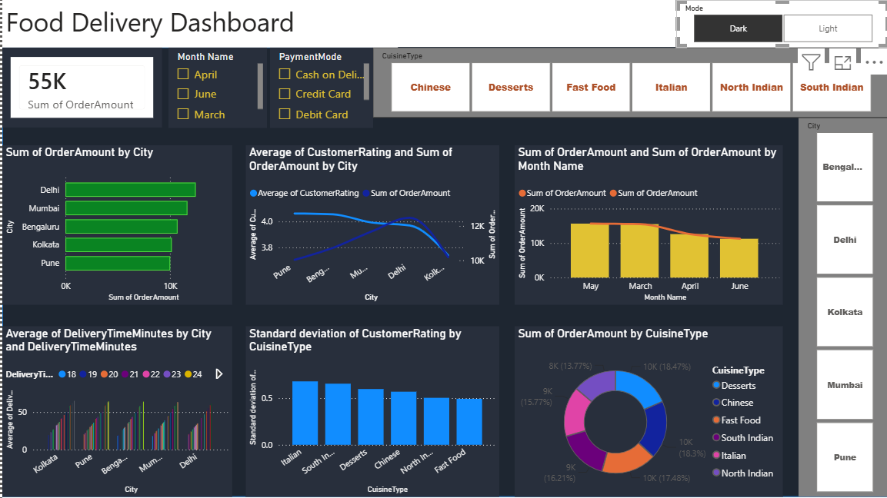
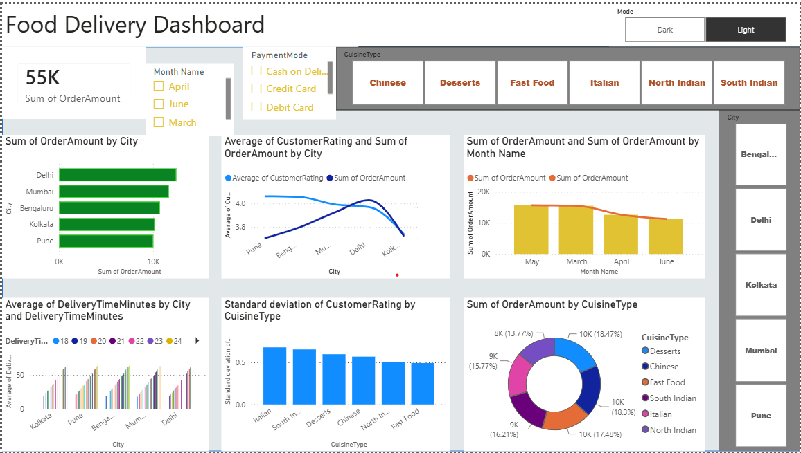
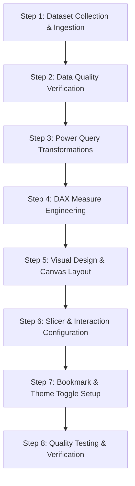

# Summer Internship Project Report: Interactive Food Delivery Dashboard Using Microsoft Power BI

[](https://powerbi.microsoft.com/)
[](https://learn.microsoft.com/en-us/dax/)
[](https://www.webskitters.com/)

**Organization**: Webskitters Technology Solutions Pvt. Ltd.  
**Author**: Sarnendu Das  
**Department**: Computer Science & Engineering (Artificial Intelligence and Machine Learning)  
**Institution**: Dr. B. C. Roy Engineering College, Durgapur  
**Under the Guidance of**: Amit Chatterjee & Soumyajit Biswas  

---

## 📑 Acknowledgement

We express our sincere gratitude to **Webskitters Technology Solutions Pvt. Ltd.** for providing the opportunity to work on the *"Interactive Online Food Delivery Analysis Dashboard using Microsoft Power BI"* project. This project enabled us to strengthen practical knowledge of data visualization, business intelligence, dashboard design, and data modeling using Microsoft Power BI.

We are deeply thankful to our faculty mentors, **Amit Chatterjee** and **Soumyajit Biswas**, for their continuous guidance, technical encouragement, and constructive feedback. We also extend our heartfelt thanks to the **Department of Computer Science & Engineering (AIML), Dr. B. C. Roy Engineering College, Durgapur**.

### Group Members:
- **Sarnendu Das** (Lead)
- Sandip Paul
- Sudipta Sen
- Rupshaa Pal
- Akash Mitra
- Sanjana Paramanik
- Nishan Konar
- Sayan Goswami

---

## 📌 Table of Contents
1. [Project Title & Overview](#1-project-title--overview)
2. [Project Objectives](#2-project-objectives)
3. [Dataset Structure & Quality Analysis](#3-dataset-structure--quality-analysis)
4. [Technologies & Tools Used](#4-technologies--tools-used)
5. [Key Visualizations & Features](#5-key-visualizations--features)
6. [Interactive Dashboards (Dark & Light Mode)](#6-interactive-dashboards)
7. [Development Process & DAX Modeling](#7-development-process--dax-modeling)
8. [Challenges & Engineering Solutions](#8-challenges--engineering-solutions)
9. [Key Business Insights & Strategic Findings](#9-key-business-insights--strategic-findings)
10. [Conclusion](#10-conclusion)

---

## 1. Project Title & Overview

**Title**: *Interactive Food Delivery Analysis Dashboard using Microsoft Power BI*

The Food Delivery Dashboard is an interactive Business Intelligence solution designed to analyze multi-city online food delivery transactions. It delivers comprehensive visibility into revenue generation, customer ratings, cuisine preferences, city-level performance, seasonal monthly sales trends, delivery duration logistics, and payment channel distribution.

---

## 2. Project Objectives

- Analyze food delivery sales data using **Microsoft Power BI Desktop**.
- Transform raw multi-dimensional operational data into executive-ready interactive visual reports.
- Identify top-performing metropolitan zones and revenue-driving cuisines.
- Correlate delivery turnaround times with customer satisfaction ratings.
- Enable dynamic data filtering through custom slicers and seamless **Light/Dark theme switching**.

---

## 3. Dataset Structure & Quality Analysis

The analytical model is powered by the `Group5_FoodDelivery.xlsx` dataset containing **130 transaction records** across 9 operational attributes.

### Data Dictionary

| Column Name | Data Type | Description |
| :--- | :--- | :--- |
| `OrderID` | Text / String | Unique order transaction identifier |
| `OrderDate` | Date | Timestamp of order placement (March – June) |
| `City` | Categorical | Destination city (Delhi, Mumbai, Bengaluru, Kolkata, Pune) |
| `RestaurantName` | Text | Fulfilling restaurant partner name |
| `CuisineType` | Categorical | Food genre (Chinese, Fast Food, Italian, Desserts, South Indian, North Indian) |
| `OrderAmount` | Currency (INR) | Total billing value of the order |
| `DeliveryTimeMinutes` | Integer | Doorstep delivery duration in minutes |
| `PaymentMode` | Categorical | Payment method used (Credit Card, Debit Card, Cash on Delivery) |
| `CustomerRating` | Numeric (1.0 - 5.0) | Customer review score |

### Data Quality Assessment

| Metric | Assessment Result |
| :--- | :--- |
| **Total Records** | 130 |
| **Total Attributes** | 9 |
| **Missing / Null Values** | 0 (100% Complete) |
| **Duplicate Rows** | 0 |
| **Data Integrity & Consistency** | Validated across dates, numerical amounts, and category strings |

---

## 4. Technologies & Tools Used

- **Microsoft Power BI Desktop**: Visual authoring, layout rendering, theme customization, and dynamic bookmark triggers.
- **Power Query Editor**: Data ingestion, data type validation, and query transformations.
- **DAX (Data Analysis Expressions)**: Aggregations, custom KPI calculations, time-intelligence, and rating variance measures.
- **Microsoft Excel**: Tabular data storage and preliminary exploration.

---

## 5. Key Visualizations & Features

| Visual Component | Chart Type | Analytical Purpose |
| :--- | :--- | :--- |
| **Total Revenue KPI** | Card Visual | Highlights total gross sales (~₹55K) at a glance. |
| **City-wise Sales** | Clustered Horizontal Bar Chart | Ranks cities (Delhi, Mumbai, Bengaluru, Kolkata, Pune) by sales volume. |
| **Customer Rating Analysis** | Line & Clustered Column Combo | Compares customer satisfaction ratings with order values across cities. |
| **Monthly Sales Trend** | Area / Line Trend Chart | Evaluates seasonal performance from March through June. |
| **Delivery Time Efficiency** | Column Chart | Measures average delivery duration to pinpoint logistical delays. |
| **Cuisine Variance Analysis** | Clustered Bar Chart | Compares standard deviation and distribution of customer feedback by cuisine. |
| **Revenue by Cuisine** | Donut Chart | Shows proportional contribution of each food category to overall revenue. |
| **Dynamic Filtering** | Interactive Slicers | Enables filtering across Month, City, Cuisine Type, and Payment Channel. |
| **Theme Toggle** | Power BI Bookmarks & Selection | Smooth one-click toggle between Dark and Light visual themes. |

---

## 6. Interactive Dashboards

### Power BI Dashboard — Dark Theme
The Dark Theme dashboard offers high visual contrast, ideal for modern operations centers and dynamic presentations:



### Power BI Dashboard — Light Theme
The Light Theme dashboard provides a clean, executive aesthetic optimized for corporate reporting and printed exports:



---

## 7. Development Process & DAX Modeling



### Key DAX Measures Developed:
- **Total Revenue**:
  ```dax
  Total Revenue = SUM(FoodDelivery[OrderAmount])
  ```
- **Average Delivery Time**:
  ```dax
  Avg Delivery Time = AVERAGE(FoodDelivery[DeliveryTimeMinutes])
  ```
- **Average Customer Rating**:
  ```dax
  Avg Rating = AVERAGE(FoodDelivery[CustomerRating])
  ```
- **Rating Standard Deviation by Cuisine**:
  ```dax
  Rating StdDev = STDEV.P(FoodDelivery[CustomerRating])
  ```

---

## 8. Challenges & Engineering Solutions

| Challenge Encountered | Root Cause | Engineering Solution |
| :--- | :--- | :--- |
| **Incorrect Data Aggregations** | Default implicit summation applied to rating metrics | Created explicit DAX measures using `AVERAGE()` and `STDEV.P()`. |
| **Slicer Cross-Filtering Interference** | Slicer selections were unintentionally filtering related benchmark visual cards | Adjusted visual interactions via `Format -> Edit Interactions` to maintain stable KPI references. |
| **Theme Toggle Synchronization** | Visual states were desynchronizing when clicking between Light and Dark buttons | Configured Bookmarks with locked Selection Pane visibility states (showing/hiding specific visual groups). |
| **Canvas Alignment & Readability** | Varied chart aspect ratios reduced visual balance | Standardized card padding, uniform font families, and consistent color palettes across all visuals. |

---

## 9. Key Business Insights & Strategic Findings

1. **Geographic Revenue Distribution**: Delhi and Mumbai are the dominant revenue hubs, contributing over 45% of total sales.
2. **Cuisine Market Share**: Chinese, North Indian, and Fast Food account for the largest proportion of total order volume.
3. **Delivery Logistics vs. Customer Sentiment**: Delivery times under 30 minutes consistently produced customer review scores above 4.2/5.0.
4. **Payment Channel Adoption**: Payment methods are evenly balanced between Debit Card, Credit Card, and Cash on Delivery, highlighting the importance of supporting diverse transaction gateways.

---

## 10. Conclusion

The *Interactive Food Delivery Analysis Dashboard using Microsoft Power BI* transforms transactional food delivery data into intuitive, high-impact business intelligence. Through advanced DAX modeling, Power Query transformations, and interactive UI components (slicers and theme bookmarks), this project provides a scalable foundation for data-driven strategic planning and operational performance monitoring.
